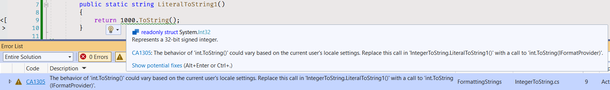

# Formatting Strings

Beginner level task for practicing a string formatting.

Estimated time to complete the task - 1.5h.

The task requires .NET 6 SDK installed.


## Task Description

In this task you have to implement six static methods that process a text and searches strings for unique words.


### 1. Integers To String

Open the [FormattingStrings.cs](FormattingStrings/IntegerToString.cs) file, and implement all methods using the information from the table below.

| Method Name       | Literal      | Literal Type | Result String  | Format Name | Precision Specifier |
|-------------------|--------------|--------------|----------------|-------------|---------------------|
| LiteralToString1  | 1000         | Decimal      | 1000           |             |                     |
| LiteralToString2  | 1234         | Decimal      | 1234           |             |                     |
| LiteralToString3  | 100,000,000  | Decimal      | 100000000      | General     |                     |
| LiteralToString4  | -123,456,789 | Decimal      | 123456789      | General     |                     |
| LiteralToString5  | ABCDEFAB     | Hexadecimal  | ABCDEFAB       | Hexadecimal |                     |
| LiteralToString6  | afbaceda     | Hexadecimal  | afbaceda       | Hexadecimal |                     |
| LiteralToString7  | A            | Hexadecimal  | 000a           | Hexadecimal | 4                   |
| LiteralToString8  | fed          | Hexadecimal  | 00000FED       | Hexadecimal | 8                   |
| LiteralToString9  | A            | Hexadecimal  | 0010           | Decimal     | 4                   |
| LiteralToString10 | fed          | Hexadecimal  | 00004077       | Decimal     | 8                   |
| LiteralToString11 | 1394         | Decimal      | ¤1,394.00      | Currency    |                     |
| LiteralToString12 | 28549        | Decimal      | ¤28,549.000000 | Currency    | 6                   |

The most simplest way to convert a number to a string is to call the `ToString` method on a number object. Each object in .NET has an [object.ToString](https://docs.microsoft.com/en-us/dotnet/api/system.object.tostring) method that returns a string that represents the object.

```cs
public static string LiteralToString1()
{
    return 1000.ToString();
}
```

Implement the method as shown in the example, and [build the solution](https://docs.microsoft.com/en-us/visualstudio/ide/building-and-cleaning-projects-and-solutions-in-visual-studio). You will get a compiler issue in the *Error List* window.



Usually, string formatting methods in .NET depends on the current culture of your system and a current [locale](https://en.wikipedia.org/wiki/Locale_(computer_software)). That means the `ToString` method may return different results in various environments. The [CA1305 issue](https://docs.microsoft.com/en-us/dotnet/fundamentals/code-analysis/quality-rules/ca1305) tells you that you can specify a culture or number format settings, to explicitly set the number format settings for a string transformation.

> How to fix violations
>
> To fix a violation of this rule, use the overload that takes an IFormatProvider argument. 

The [int.ToString](https://docs.microsoft.com/en-us/dotnet/api/system.int32.tostring) method has an overload with the [IFormatProvider](https://docs.microsoft.com/en-us/dotnet/api/system.iformatprovider) parameter that supplies culture-specific formatting information.

```cs
public string ToString (IFormatProvider? provider);
```

The `IFormatProvider` is an [interface](https://docs.microsoft.com/en-us/dotnet/csharp/language-reference/keywords/interface) that provides a mechanism for retrieving an object to control formatting. To provide an information about a specific culture, you may use the [CultureInfo class](https://docs.microsoft.com/en-us/dotnet/api/system.globalization.cultureinfo). The `CultureInfo` class implements `IFormatProvider` interface, therefore you can pass an instance of the `CultureInfo` class to the `ToString` method as a parameter.

```cs
public class CultureInfo : ICloneable, IFormatProvider
```

In this task you will use a special *invariant culture* object. The invariant culture is culture-insensitive; it is associated with the English language, but not with any country or region.

Use the [CultureInfo.InvariantCulture](https://docs.microsoft.com/en-us/dotnet/api/system.globalization.cultureinfo.invariantculture) property to get the `CultureInfo` object that is culture-independent.

```cs
public static string LiteralToString1()
{
    return 1000.ToString(System.Globalization.CultureInfo.InvariantCulture);
}
```

The `int.ToString` method has another overload that allows to specify a numeric format string.

```cs
public string ToString (string? format, IFormatProvider? provider);
```

A numeric format string can be [standard](https://docs.microsoft.com/en-us/dotnet/standard/base-types/standard-numeric-format-strings#standard-format-specifiers) or [custom](https://docs.microsoft.com/en-us/dotnet/standard/base-types/custom-numeric-format-strings). We will use the only *standard* numeric format strings in this task.

Implement the `LiteralToString3` method using the [general format specifier ("G")](https://docs.microsoft.com/en-us/dotnet/standard/base-types/standard-numeric-format-strings#GFormatString).

```cs
public static string LiteralToString3()
{
    return 100_000_000.ToString("G", CultureInfo.InvariantCulture);
}
```

Find the *general format* in the standard numeric format specifiers table. The format description:

> Result: The more compact of either fixed-point or scientific notation.
> 
> Supported by: All numeric types.

The general format supports all numeric types including `int`.

In the `LiteralToString5` method use the *hexadecimal* format specifier to produce a hexadecimal representation of a number.

```cs
public static string LiteralToString5()
{
    return 0xABCDEFAB.ToString("X", CultureInfo.InvariantInfo);
}
```

The hexadecimal format supports only integral types. That means it doesn't support `float`, `double` and `decimal` types. The format description:

> Result: A hexadecimal string.
> 
> Supported by: Integral types only.
> 
> Precision specifier: Number of digits in the result string.

The standard numeric format strings allows you to set a *precision specifier* that is an optional parameter affecting a result string. Implement the `LiteralToString7` method using the hexadecimal numeric format with a precision specifier to specify the number of digits in the result string.

```cs
public static string LiteralToString7()
{
    return 0xA.ToString("x4", CultureInfo.InvariantCulture);
}
```

Implement the `LiteralToString9` method using the *decimal* numeric format to produce a decimal string representation of a number. Set the precision specifier to specify the minimum number of digits.

```cs
public static string LiteralToString9()
{
    return 0xA.ToString("D4", CultureInfo.InvariantCulture);
}
```

There is the *currency* numeric format that is used to produce a string representation of a currency amount. The format description:

> Result: A currency value.
>
> Supported by: All numeric types.
>
> Precision specifier: Number of decimal digits.
> 
> Default precision specifier: Defined by NumberFormatInfo.CurrencyDecimalDigits.

The [NumberFormatInfo](https://docs.microsoft.com/en-us/dotnet/api/system.globalization.numberformatinfo) class provides culture-specific information for formatting and parsing numeric values. The `CultureInfo` class has the [NumberFormat](https://docs.microsoft.com/en-us/dotnet/api/system.globalization.cultureinfo.numberformat) property that is of `NumberFormatInfo` type.

```cs
public virtual System.Globalization.NumberFormatInfo NumberFormat { get; set; }
```

When the `ToString` method gets a `CultureInfo` argument, it gets an object from the `NumberFormat` property and uses the object information to format a number. If the currency number format has no precision specified, the `ToString` method gets the default value from the [CurrencyDecimalDigits](https://docs.microsoft.com/en-us/dotnet/api/system.globalization.numberformatinfo.currencydecimaldigits) property.

Implement the `LiteralToString11` method using the currency numeric format to produce a currency value.

```cs
public static string LiteralToString11()
{
    return 1394.ToString("C", CultureInfo.InvariantInfo);
}
```


### 2. Numbers To String

Open the [NumbersToString.cs](FormattingStrings/NumbersToString.cs) file, and implement all methods using the information from the table below. In this section you should pass the correct format string to the `ToString` method.

| Method Name      | Format Name |
|------------------|-------------|
| NumberToString1  | Fixed-point |
| NumberToString2  | Fixed-point |
| NumberToString3  | Number      |
| NumberToString4  | Number      |
| NumberToString5  | Currency    |
| NumberToString6  | Currency    |
| NumberToString7  | Percent     |
| NumberToString8  | Percent     |
| NumberToString9  | General     |
| NumberToString10 | General     |

Use the [NumberFormatInfo.InvariantInfo](https://docs.microsoft.com/en-us/dotnet/api/system.globalization.numberformatinfo.invariantinfo) property to get an object with culture-independent information and pass the object to the `ToString` method as the `provider` argument. 

```cs
public static string NumberToString1(float number)
{
    return number.ToString("F4", NumberFormatInfo.InvariantInfo);
}
```


### 3. Formatting Strings

Open the [FormatStrings.cs](FormattingStrings/FormatStrings.cs) file, and implement all methods.

Use the [string.Format](https://docs.microsoft.com/en-us/dotnet/api/system.string.format) to convert the value of arguments to strings and [concatenate the strings into a result string](https://docs.microsoft.com/en-us/dotnet/api/system.string.format#insert-a-string).

```cs
public static string Format1(int number1, int number2, float number3, double number4)
{
    return string.Format(NumberFormatInfo.InvariantInfo, "{0} {2} {1} {3}", number1, number2, number3, number4);
}
```

The format string elements wrapped in braces are *format items*. The number is braces is the index of the object whose string value will be inserted at the position.

You can follow the index in a format item with a format string to [control how an object is formatted](https://docs.microsoft.com/en-us/dotnet/api/system.string.format#control-formatting). Add format specifiers to the format string in the `Format3` method to get the correct [CSV](https://en.wikipedia.org/wiki/Comma-separated_values) line.

```cs
public static string Format3(string str1, float number1, double number2, int number3)
{
    return string.Format(NumberFormatInfo.InvariantInfo, "{3}, {0}, {1:P0}, {2:C2}", str1, number1, number2, number3);
}
```

Open and closing braces are interpreted as starting and ending a format item. Consequently, you must use an [escape sequence](https://docs.microsoft.com/en-us/dotnet/standard/base-types/composite-formatting#escaping-braces) to display a literal opening brace or closing brace. Specify two opening braces ("{{") in the fixed text to display one opening brace ("{"), or two closing braces ("}}") to display one closing brace ("}"). 

Add [escape braces](](https://docs.microsoft.com/en-us/dotnet/api/system.string.format#how-do-i-include-literal-braces--and--in-the-result-string)) to the format string in the `Format5` method to form the valid [JSON document](https://en.wikipedia.org/wiki/JSON).

```cs
public static string Format5(string str1, double number1, int number2, int number3)
{
    return string.Format(NumberFormatInfo.InvariantInfo, "{{ \"id\": {3:D}, \"name\": \"{0}\", \"deposit\": {1:F}, \"days\": {2:D3} }}", str1, number1, number2, number3);
}
```

You can define the width of the string that is inserted into the result string by using syntax such as `{0,9}`, which inserts a 9-character string. In this case, the string representation of the first object is right-aligned in the 12-character field. Specify the width of the table columns in the `Format7` method.

```cs
public static string Format7(string str1, string str2, float number1, float number2, int number3)
{
    return string.Format(NumberFormatInfo.InvariantInfo, "|{4,6}|{0,9}|{2,8}|{1,9}|{3,6}|", str1, str2, number1, number2, number3);
}
```

By default, strings are right-aligned within their field if you specify a field width. To left-align strings in a field, you preface the field width with a negative sign, such as `{0,-12}` to define a 12-character left-aligned field. Specify the width of the table columns in the `Format10` method and add negative signs for columns that are left-aligned.

```cs
public static string Format9(string str1, string str2, float number1, float number2, float number3)
{
    return string.Format(NumberFormatInfo.InvariantInfo, "| {4,10:P} | {0,-12} | {1,-14} | {3,12:C2} | {2,-20:N4} |", str1, str2, number1, number2, number3);
}
```


### 4. Formatting Interpolated Strings

Open the [Interpolation.cs](FormattingStrings/Interpolation.cs) file, and implement all methods.

The [FormattableString](https://docs.microsoft.com/en-us/dotnet/api/system.formattablestring) class is used to format an interpolated string with a culture settings. The `FormattableString` class represents a composite format string, along with the arguments to be formatted. To get a formatted string in which arguments are formatted by using the conventions of the invariant culture use the [FormattableString.Invariant](https://docs.microsoft.com/en-us/dotnet/api/system.formattablestring.invariant) method.

```cs
public static string GetDepositCsv(int id, string name, string iban, decimal deposit, decimal balance, double interestRate)
{
    FormattableString csv = $@"{id},""{name}"",{balance:F2},""{interestRate:P2}"",""{deposit:C4}"",{iban}";
    return FormattableString.Invariant(csv);
}
```


## See also

* [$ - string interpolation](https://docs.microsoft.com/en-us/dotnet/csharp/language-reference/tokens/interpolated)
* [Standard numeric format strings](https://docs.microsoft.com/en-us/dotnet/standard/base-types/standard-numeric-format-strings)
* [Composite Formatting](https://docs.microsoft.com/en-us/dotnet/standard/base-types/composite-formatting)
* [interface](https://docs.microsoft.com/en-us/dotnet/csharp/language-reference/keywords/interface)
* .NET API
  * [Object.ToString Method](https://docs.microsoft.com/en-us/dotnet/api/system.object.tostring)
  * [Int32.ToString Method](https://docs.microsoft.com/en-us/dotnet/api/system.int32.tostring)
  * [string.Format Method](https://docs.microsoft.com/en-us/dotnet/api/system.string.format)
  * [FormattableString Class](https://docs.microsoft.com/en-us/dotnet/api/system.formattablestring)
  * [IFormatProvider Interface](https://docs.microsoft.com/en-us/dotnet/api/system.iformatprovider)
  * [CultureInfo Class](https://docs.microsoft.com/en-us/dotnet/api/system.globalization.cultureinfo)
  * [NumberFormatInfo Class](https://docs.microsoft.com/en-us/dotnet/api/system.globalization.numberformatinfo)